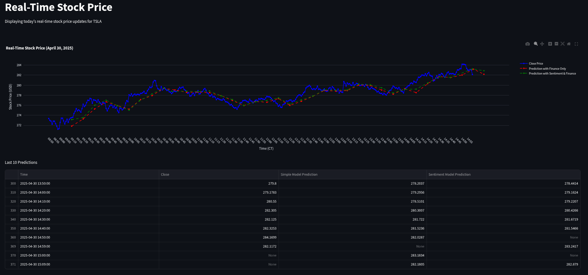

# Real-Time Stock Prediction with Sentiment Integration



## Abstract
This project presents a real-time system that automatically collects `$TSLA` stock data from Yahoo Finance and scrapes tweets from X.com (formerly Twitter) every 10 minutes. Tweets are filtered and preprocessed by removing noise such as special characters, URLs, and mentions. The system combines financial features—Open, High, Low, Close, Volume (OHLCV)—with tweet engagement metrics, including number of views, likes, replies, and retweets. Sentiment is extracted using an NLP-based emotion classifier that assigns each tweet a score across 11 distinct emotion categories. Two Long Short-Term Memory (LSTM) models are trained: one using only financial data, and the other incorporating both financial and sentiment features. The performance of each model is compared to evaluate the impact of social sentiment on short-term stock price prediction. A web-based dashboard visualizes predictions updated in real time. The research shows that while the financial-only model delivers more stable precision, the sentiment-enhanced model performs better during volatile sessions or periods of high social media activity around the stock. An optimized hybrid model using both architectures with a dynamic signal system is proposed to improve predictive precision under varying market conditions.

## How to Run
Create a `.env` file with the following:

```
bravePath = 

twitterUsername = 
twitterEmail = 
twitterPassword = 
```

For the first time, in `twitterWebScraperNB.ipynb`, run `driver = tempLogin()` (after running all other prerequisites in the notebook). Then login normally, and a `cookies` folder should generate when you run `driver.quit()`.

From now on, run `python main.py` in one terminal and `streamlit run app.py` in the other.